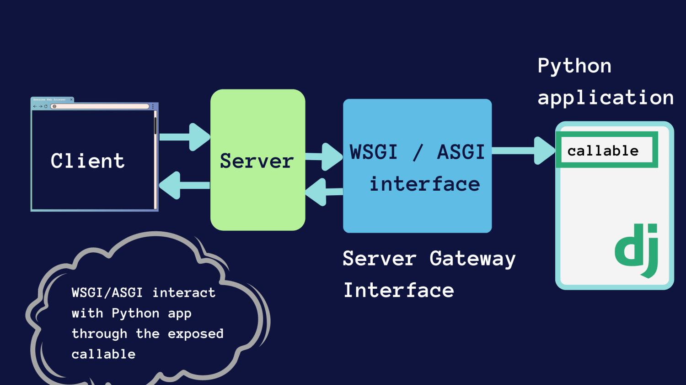
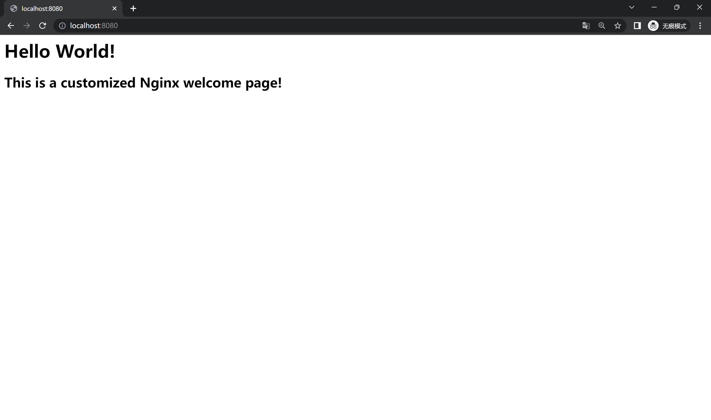

# 应用部署

## 部署简介
应用部署是指将开发的应用程序从开发环境迁移到生产环境的过程，以便最终用户能够访问和使用。

以 Python Web 项目为例，在生产环境中，一般需要使用 Nginx 做反向代理服务器。[Nginx](http://nginx.org/en/docs/install.html) 是一种高效的 HTTP 和反向代理服务器。在生产环境中使用 Nginx，可以帮助处理和平衡进入应用程序的流量，还能提供额外的安全层。它可以接收到客户端的请求，并将其转发到后台服务器，然后再将后台服务器的响应转发给客户端。你可以参考这个博客了解更多：[Nginx使用教程](https://juejin.im/post/6844903944267759624)


在 Python Web 应用的部署过程中，我们经常会遇到这样的需求：既需要能处理 HTTP 请求/响应等底层网络协议的 Web 服务器（如 Nginx 或 Apache ），又需要执行 Python 代码逻辑的应用服务器。但是，Web 服务器一般并不擅长直接运行 Python 代码，而 Python 应用则无法直接处理底层的 HTTP 请求。这就需要一个中间层来进行桥接。WSGI 服务器扮演了这一角色，它的作用就是接收来自 Web 服务器（如 Nginx）的请求，然后将这些请求转发给 Python 应用程序，同时，Python 应用程序的响应也会经过 WSGI 服务器，再返回给 Web 服务器，最终再由 Web 服务器返回给用户。

以[Gunicorn WSGI](https://gunicorn.org/)服务器为例，它是一个 Python WSGI HTTP 服务器，使用四个 worker 进程来运行 Web 应用，以提高服务器的并发处理能力：
``` { .bash .copy }
$ gunicorn -w4 myapp:app
```

这样部署的部署方式最终形成了下图所示的架构：
 

由此可见，在生产环境中部署Web应用程序远比在本地运行更为复杂。不仅需要部署应用本身，还需要配置和管理诸如Nginx这样的Web服务器和Gunicorn这样的WSGI服务器，这些都是生产环境中必不可少的组件。同时，还需要处理安全性、可扩展性、日志管理、错误监控等问题。而且，还需要考虑到数据库、缓存、消息队列等其他依赖服务的配置和管理。所有这些因素都使得应用部署变得相当复杂，需要精心的规划和严谨的操作。虽然这需要付出更多的努力，但这是为了确保应用在生产环境中的稳定性和可用性。

## 传统部署中的挑战与困扰
在互联网的早期，部署是一个手动、耗时且容易出错的过程。开发者需要在生产服务器上手动安装必要的软件，配置系统和应用设置，然后将应用代码从版本控制系统中拉取或者复制过去，最后手动启动应用。这种方法的问题存在诸多问题：

1. **环境配置的复杂性**：环境配置的过程可能十分繁琐，尤其是当依赖库之间存在严重耦合时。这不仅会导致部署过程的困难，也会增大交接和沟通的成本，因为每次变更或者新人接手都需要完全理解所有配置和依赖关系。
2. **服务器崩溃和迁移的问题**：如果服务器突然崩溃，或者需要迁移到新的集群，常常需要重新部署应用，这可能会耗费大量的时间和精力。
3. **系统特性的影响**：不同的操作系统可能需要设置不同的开机自启动脚本，这增加了配置的复杂性。另外，更换系统或者升级系统版本可能会导致项目无法启动。
4. **扩展性的问题**：传统的部署方式难以实现快速多机部署和横向扩容，这限制了应用的扩展性和高可用性。
5. **资源消耗和效率问题**：如果使用虚拟机的方式进行部署，往往会有资源消耗过大、启动慢等问题。这既影响了应用的响应速度，也浪费了服务器资源。

为了应对这些挑战，出现了一种新的部署方式：容器化部署。Docker 等容器化工具允许开发者打包应用及其全部依赖到一个隔离的环境中，从而在任何支持 Docker 的系统上以相同的方式运行，这简化了部署过程，提高了应用的可移植性和可扩展性。

## Docker
Docker 是一个开源的容器引擎，允许开发者打包他们的应用以及依赖包到一个可移植的容器中，然后发布到任何流行的 Linux 机器或 Windows 机器上，也可以实现虚拟化。容器是完全使用沙盒机制，相互之间不会有任何接口。

### Docker的优势

1. **简化程序**：Docker 允许开发者使用任何语言来创建应用和服务，并且可以与其它工具无缝集成。
2. **代码流水线管理**：Docker 可以构建/发布版本和快速、可靠地复制环境。它的容器化特性使得持续集成/持续部署(CI / CD)流程更为简单。
3. **开发和部署的一致性**：Docker 能确保应用在本地和生产环境中的一致性，无需再担心 "在我的机器上运行正常" 的问题。
4. **快速高效**：Docker 容器相比虚拟机更为轻量且启动更快，它直接运行在宿主机的内核上，无需额外的 Hypervisor 层。因此，它的性能更好，启动更快，在相同的硬件条件下可以运行更多的容器。
5. **隔离的应用环境**：每个 Docker 容器都运行在自己的环境中，它们互不影响，可以独立升级和维护，增强了安全性。
6. **可扩展性**：Docker 的集群管理工具（如 Kubernetes 或 Docker Swarm）可以让应用轻松实现横向扩展，以应对各种负载。

<figure markdown>
{ loading=lazy }
<figcaption>虚拟机 vs 容器</figcaption>
</figure>

### 主要组件
- **Image 镜像**：特殊文件系统，提供运行时所需程序、库、资源和配置等文件，在构建完成后不会改变。
- **Container 容器**：容器是镜像运行时的实体，可以被创建、启动、停止和删除，与镜像的关系可以类比为OOP中的实例与类。
- **Registry 仓库**：镜像的集中存储分发 一个镜像包括名称和标签，默认标签为`latest`。例如`ubuntu:18.04`。

<figure markdown>
{ loading=lazy }
<figcaption>Docker 镜像、容器和 Registry 的关系</figcaption>
</figure>

在整个工作流程中，开发人员通常会先从 Registry 仓库拉取所需的镜像到本地，然后基于镜像创建并启动容器。在容器中，开发人员可以运行应用，进行开发和测试工作。当开发完毕，也可以将修改后的镜像推送回仓库，以便其他人或在其他环境中使用。这样，通过 Image 镜像、Container 容器和 Registry 仓库的协同工作，Docker 实现了应用的快速部署、扩展和迁移。

### Docker 安装
可以参考[官方文档](https://docs.docker.com/engine/install/)，或者参照[ Docker—从入门到实践](https://yeasy.gitbook.io/docker_practice/install)进行安装，本次实验中你可以使用带GUI的Docker Desktop，也可以使用命令行版本的Docker Engine。

由于网络问题，国内用户在拉取 Docker Hub 的镜像时可能会遇到速度较慢的问题。可以考虑使用各类的镜像来加速拉取

- 中科大镜像：https://docker.mirrors.ustc.edu.cn
- 网易云镜像：https://hub-mirror.c.163.com
- 百度云镜像：https://mirror.baidubce.com

[这份教程](https://yeasy.gitbook.io/docker_practice/install/mirror)介绍了如何在已经安装好 Docker 的情况下，配置镜像加速器。

### 常用命令
本小节将以一个简单的例子介绍Docker的工作流程，以及其中最常用的几个命令，更多命令可以参考[官方文档](https://docs.docker.com/engine/reference/commandline/docker/)。

例如我们要以容器化的方式运行Nginx，首先从Docker Hub拉取最新版本的Nginx镜像：

```bash
$ docker pull nginx:latest
```
可以通过 `docker image ls` 来查看本地已有的镜像：

```bash
$ docker image ls
REPOSITORY   TAG       IMAGE ID       CREATED       SIZE
nginx        latest    eb4a57159180   2 weeks ago   187MB
```

镜像拉取成功后，可以基于这个镜像创建并运行一个新的容器：

```bash
$ docker run -d -p 8080:80 --name nginx nginx:latest
```

`run`命令基于镜像创建并启动一个新的容器，`-d` 参数使得容器在后台运行，`-p 8080:80` 表示将容器的 80 端口映射到主机的 8080 端口，`--name nginx` 表示容器的名称为 nginx，`nginx:latest` 表示使用的镜像版本。

使用`docker ps`命令就能查看正在运行中的容器：

```bash
$ docker ps
CONTAINER ID   IMAGE          COMMAND                  CREATED         STATUS         PORTS                  NAMES
8415482a6e05   nginx:latest   "/docker-entrypoint.…"   5 seconds ago   Up 5 seconds   0.0.0.0:8080->80/tcp   nginx
```

这样我们就可以通过访问主机的 8080 端口来访问运行在容器中的 Nginx 服务器。


### Dockerfile
Dockerfile 是一个文本文件，其中包含了一系列的命令，这些命令被用于自动创建 Docker 镜像。每一条命令都会在镜像上创建一个新的层，最终形成了一个完整的镜像。这就像一个自动化脚本，开发者可以通过 Dockerfile 来定义应用运行所需的环境，包括操作系统、软件库、环境变量、文件以及运行的命令等。

!!! question "为什么需要Dockerfile"
    虽然我们可以通过 `docker pull` 来从 Docker Hub 获取预先定义好的镜像，然后使用 `docker run` 来运行这些镜像，但这仅仅适用于比较简单的情况。对于复杂的业务需求，我们可能需要定制化的镜像，例如安装特定版本的软件库，添加特定的配置文件，运行特定的启动脚本等。在这种情况下，仅仅依赖已经构建好的镜像是不足以满足需求的。
    

通过使用 Dockerfile，我们可以详细地描述镜像构建的每一个步骤，将复杂的构建过程自动化。这样，无论何时何地，只要有 Dockerfile 和相应的依赖文件，我们都能构建出完全相同的镜像，从而实现了应用部署环境的一致性。同时，Dockerfile 还能被用作版本控制，可以追踪镜像的修改历史，有利于团队协作和问题排查。因此，对于复杂的业务需求，Dockerfile 是一个非常重要的工具。

下面将用一个简单的例子来说明Dockerfile的作用。

假设我们想创建一个运行 Nginx 服务器的 Docker 镜像，并且在这个镜像中，我们想使用**自定义**的 Nginx **配置文件和网站页面**。在这种情况下，我们就可以使用 Dockerfile 来构建这个镜像。一个基本的 Dockerfile 可能如下

```Dockerfile
FROM nginx:latest 

COPY nginx.conf /etc/nginx/nginx.conf

COPY index.html /usr/share/nginx/html/index.html

EXPOSE 80

CMD ["nginx", "-g", "daemon off;"]
```

这个 Dockerfile 执行的第一步是从 Docker Hub 下载最新版本的官方 Nginx 镜像，如果本地已经有这个镜像，就不会再次下载。接着，它会将我们本地的 nginx.conf 文件复制到容器的 `/etc/nginx/nginx.conf`，以覆盖默认的 Nginx 配置文件。然后，它会将我们的网站页面复制到容器的网站根目录中。在开放 80 端口后，我们通过 CMD 指令设置容器启动时运行 Nginx 服务器。

在本地，我们的 nginx.conf 和 index.html 内容如下
=== "`nginx.conf`"

    ```conf
    events {
        worker_connections 1024;
    }

    http {
        server {
            listen 80;

            location / {
                root /usr/share/nginx/html;
                index index.html index.htm;
            }
        }
    }
    ```

=== "`index.html`"

    ```html
    <h1> Hello World! </h1>
    <h2> This is a customized Nginx welcome page! </h2>
    ```

完成这个 Dockerfile 后，我们就可以通过 docker build 命令在 Dockerfile 所在的目录下来构建这个新的镜像：
```bash
docker build -t my-nginx .
```
这条命令将会在当前目录（由 `.` 指定）下查找 Dockerfile 并根据其内容构建一个新的 Docker 镜像，镜像名称为 my-nginx。

在镜像构建完成后，我们就可以使用 docker run 命令来启动这个镜像，运行我们的自定义 Nginx 服务器：
```bash
docker run -d -p 8080:80 --name custom-nginx my-nginx
```
这样访问主机的 8080 端口就可以看到我们自定义的 Nginx 服务器了。

<figure markdown>
{loading=lazy}
<figcaption>使用 Dockerfile 定制化的 Nginx 容器</figcaption>
</figure>

你可以参照 [这个链接](https://yeasy.gitbook.io/docker_practice/image/build) 来学习更多关于Dockerfile的内容。

### Docker Compose
Docker Compose是一个用于编排多个Docker容器的工具，它的主要目标是“定义和运行由多个Docker容器组成的应用”。用户可以通过一个名为`docker-compose.yml`的模板文件，定义一组互相关联的应用容器，这些容器协同工作，共同组成一个项目。

在Docker Compose的语境下，我们会遇到两个核心概念：Service和Project。

Service，或者说服务，主要代表应用的容器。每个服务在Docker Compose中都运行在它自己的容器中，并扮演着特定的角色。例如，在一个网页应用中，可能会有一个服务负责运行Web服务器，另一个服务负责运行数据库。这些服务可以单独进行扩展和调整，以满足各自的需求和性能目标。

Project，或者说项目，是由一组容器组成的业务单元。这些容器通过`docker-compose.yml`模板文件进行定义，并协同工作以实现一项特定的业务功能。项目让我们可以在更高的层次上理解和管理应用，因为它把可能包含多个服务（即多个容器）的应用视作一个整体。

因此，Docker Compose的主要优势在于它简化了管理和组织多容器应用的过程。用户不再需要单独地运行和配置每一个容器，而是可以通过单一的`docker-compose.yml`文件，以一种声明式的方式，描述出所有服务的配置和他们之间的关系，从而更高效地部署和运行复杂的多容器应用。

### 实例
下面我们以一个实际项目来说明 Dockerfile 和 Docker Compose 的使用方法，[项目地址](https://github.com/PowerfooI/django-docker-tutorial)

该项目由三个主要部分组成，分别为：

- 一个基于 Django 的 MVC 应用
- MySQL 数据库用作应用的数据存储
- Nginx 作为应用的 Web 服务器

项目的目录结构如下：
```bash
├── Dockerfile          # 用于构建应用（app）容器
├── README.md
├── collected_static
├── config
├── django_app          # Django 应用的代码
├── docker-compose.yml  # 用于编排多个容器
├── manage.py
└── requirements.txt
```

相信各位同学已经在**之前的课程中**学习过 Web 开发的相关知识，因此这里不再赘述。我们的目标是将这个项目容器化，使得我们可以通过 Docker Compose 来一键启动或者部署整个项目。

首先我们看一下 Dockerfile 的内容：
```dockerfile
FROM python:3.7

ENV PYTHONUNBUFFERED 1

RUN mkdir /code
WORKDIR /code
RUN pip install pip -U -i https://pypi.tuna.tsinghua.edu.cn/simple
ADD requirements.txt /code/
RUN pip install -r requirements.txt -i https://pypi.tuna.tsinghua.edu.cn/simple
ADD . /code/
```
这个 Dockerfile 的内容比较简单，它首先指定了基础镜像为 Python 3.7，然后安装了项目所需要的依赖，最后将项目的代码复制到镜像中。这样我们就可以通过 Dockerfile 来构建一个包含项目代码和依赖的镜像了。

??? tip "如何调试 Dockerfile 的构建"
    在实际编写 Dockerfile 的过程中，我们可能会遇到一些问题，例如某些依赖无法安装、代码无法复制等等。这时我们可以通过在 Dockerfile 中添加一些**调试信息**来帮助我们定位问题。例如，我们可以在 Dockerfile 中添加一条 `RUN ls -l` 命令来查看当前目录下的文件列表，或者添加一条 `RUN echo $PYTHONPATH` 命令来查看环境变量的值。这些调试信息可以帮助我们更好地理解 Dockerfile 的构建过程，从而更好地定位问题。

??? tip "如何确定构建的 Dockerfile 符合预期"
    在构建好镜像之后，我们可能需要判断镜像是否符合预期。例如，我们可以通过 `docker run -it <image_name> /bin/bash` 命令来启动一个容器，或者通过`docker exec -it <container_name> /bin/bash` 命令来进入一个已经启动的容器，并在容器中利用 Linux 的命令行工具来查看容器中的文件列表、环境变量等信息。

---

前面我们提到过，项目由三个主要部分组成，分别是数据库、Nginx 和 Django 应用。因此，在 `docker-compose.yaml` 文件中也分别定义了三者的配置：
=== "`App`"

    ```yaml
    app:
      restart: always
      build: .
      command: >
        bash -c
        "python3 manage.py collectstatic --no-input &&
        python3 manage.py migrate &&
        gunicorn --timeout=30 --workers=4 --bind :8000 django_app.wsgi:application"
      volumes:
        - .:/code
        - static-volume:/code/static
      expose:
        - "8000"
      depends_on:
        - db
      networks:
        - web_network
        - db_network
    ```
    对于 Django 应用，`build .` 指定了构建镜像的路径，`command` 代表容器启动时执行的命令，我们想让容器在启动时自动执行 Django 的数据迁移和静态文件收集操作，然后使用 Gunicorn 启动 Django 应用。

    `volumes` 用于指定容器与宿主机的文件映射关系，这里我们将宿主机的当前目录映射到容器的 `/code` 目录，这样我们就可以在宿主机上修改代码，然后在容器中运行最新的代码了。`expose` 用于指定容器暴露的端口，这里我们将容器的 8000 端口暴露出来，以便我们可以通过宿主机的 8000 端口来访问容器中的 Django 应用。`depends_on` 用于指定容器之间的依赖关系，这里我们指定了 Django 应用依赖于数据库，这样在启动 Django 应用之前，数据库就已经启动了。`networks` 用于指定容器所属的网络，这里我们将 Django 应用和数据库分别放在了两个网络中，这样可以有效地隔离 Django 应用和数据库，从而提高安全性。

=== "`MySQL`"

    ```yaml
    db:
      image: mysql:5.7
      volumes:
        - "./mysql:/var/lib/mysql"
      env_file: .env
      expose:
        - "3306"
      restart: always
      environment:
        - MYSQL_DATABASE=${DB_NAME}
        - MYSQL_ROOT_PASSWORD=${DB_PASSWORD}
      networks:
        - db_network
    ```
    数据库使用的是 MySQL 5.7 镜像，`volumes` 用于指定容器与宿主机的文件映射关系，这里我们将宿主机的 `./mysql` 目录映射到容器的 `/var/lib/mysql` 目录，这样我们就可以在宿主机上持久化地保存数据库的数据了。`env_file` 用于指定环境变量文件，这里我们将环境变量文件 `.env` 映射到容器中，这样容器就可以读取环境变量文件中的环境变量了。`expose` 用于指定容器暴露的端口，这里我们将容器的 3306 端口暴露出来，以便我们可以通过宿主机的 3306 端口来访问容器中的 MySQL 服务。`restart` 用于指定容器的重启策略，这里我们指定了容器总是在退出时重启。`environment` 用于指定容器的环境变量，这里我们指定了数据库初始化时的用户名和密码。`networks` 用于指定容器所属的网络，这里我们将数据库放在了 `db_network` 网络中。

=== "`Nginx`"

    ```yaml
    nginx:
      restart: always
      image: nginx:latest
      ports:
        - "8001:8000"
      volumes:
        - static-volume:/code/static
        - ./config/nginx:/etc/nginx/conf.d
      depends_on:
        - app
      networks:
        - web_network
    ```
    Ngix 使用的是官方的最新镜像，`ports` 用于指定容器暴露的端口，这里我们将容器的 8000 端口映射到宿主机的 8001 端口，以便我们可以通过宿主机的 8001 端口来访问容器中的 Django 应用。`volumes` 用于指定容器与宿主机的文件映射关系，这里我们将宿主机的 `./config/nginx` 目录映射到容器的 `/etc/nginx/conf.d` 目录，这样我们就可以在宿主机上修改 Nginx 的配置文件了。`depends_on` 用于指定容器之间的依赖关系，这里我们指定了 Nginx 依赖于 Django 应用，这样在启动 Nginx 之前，Django 应用就已经启动了。`networks` 用于指定容器所属的网络，这里我们将 Nginx 放在了 `web_network` 网络中。

=== "`Network`"
    ```yaml
    networks:
      web_network:
        driver: bridge
      db_network:
        driver: bridge
    ```
    `networks` 用于指定容器所属的网络，这里我们分别创建了 `web_network` 和 `db_network` 两个网络，其中 `web_network` 用于连接 Django 应用和 Nginx，`db_network` 用于连接 Django 应用和 MySQL。这样做的好处在于，我们可以而有效地隔离 Django 应用、Nginx 和 MySQL，提高安全性。

---

在启动容器之前，我们还需要做如下准备

- 首先需要将目录中的 `.env_example` 文件复制一份，重命名为 `.env`，并修改其中的环境变量 [DB_NAME] 和 [DB_PASSWORD]，用于 MySQL 镜像的配置和使用。
- 然后将 `django_apps/settings.py` 中的 `DATABASES` 配置修改为如下内容：

在做好了这些配置后，我们就可以通过如下命令一键启动我们的 Django 应用了：

```bash
$ docker-compose up
```
访问 `http://localhost:8001`，你就可以看到页面了。

## 作业要求
本次作业需要修改项目清软论坛中的`Dockerfile`和`docker-compose.yaml`文件来实现容器化部署。具体要求如下：

1. ssh 连接至你个人的远端服务器，安装 Docker 并保持后台运行。
2. 编写合适的 Dockerfile 以及 docker-compose 配置（必要时你需要调整清软论坛的代码）来实现：
    - 清软论坛以 MySQL 为数据库、通过 nginx 以 8000 端口向外提供服务；
    - 通过你的服务器 `ip:8000` 可以访问到论坛前端并正常进行各项操作；
    - 通过你的服务器 `ip:8000/api/v1` 可以直接访问后端的各项 API；
3. 其他要求
    - 你的 Python 版本需要恰好为 3.8.x，你的Nginx版本为 latest，MySQL 版本恰好为5.7；
    - 各个 service 之间的依赖关系应当合理；
    - 清软论坛镜像 container 名称为 app，nginx 镜像 container 名称为 nginx，MySQL 镜像的container 名称为 mysql；（你可以在 docker-compose 配置中指定 container name）
    - 你的数据库使用账号 root（默认值），其密码为你的学号，数据库名称为 thss，使用端口3306（默认值）。请注意 MySQL 默认镜像的时区为 UTC，字符集是 latin1，你也需要进行调整。可以通过在 docker-compose 中指定下述值实现：
        ```yaml
        environment:
        - MYSQL_ROOT_PASSWORD=<你的学号>
        - MYSQL_DATABASE=thss
        - TZ=Asia/Shanghai
        command: ['mysqld', '--character-set-server=utf8mb4', '--collation-server=utf8mb4_unicode_ci']
        ```
    - 你的前端文件应该通过 nginx 的静态文件服务实现（在目前的项目中是通过单独的 React 服务实现的，你需要通过 `npm build` 打包后将其改为 nginx 静态文件服务实现）。你可以使用 volume 实现也可以构建⼀个基于 nginx 的镜像实现。在构建前端之前，你需要更改 `frontend/package.json`中的`proxy`字段为正确的URL，这样前端才能正确地访问后端。
    - nginx 与论坛后端处于⼀个 network，论坛后端与数据库处于⼀个 network。也即通过 nginx 所在容器无法访问数据库容器；
    - 仅 nginx 容器将端口映射给宿主机，端口号为 8000；
    - MySQL 镜像需要指定 `/home/ubuntu/mysql/` 文件夹为持久化存储 Volume，将镜像内 `/var/lib/mysql` 目录挂载到宿主机的 `/home/ubuntu/mysql/` 目录；
    - 你的服务需要至少持续工作至作业截止日期后两周。如果无法访问，助教会与你取得联系，请保持联系方式的畅通。

!!! Danger "注意事项"
    服务器上的所有文件的最后修改时间和服务开始运行的时间需要**保持在作业截止日期之前**，否则你的作业将会视情况扣除一定分数。
    你提交的代码将被作为**查重的依据**，请务必保证你的代码是自己独立完成的。

## 延展阅读
如果你想进一步深入了解Docker的实现原理，例如Cgroups、Namespace等技术，可以参考[这篇博客](https://mp.weixin.qq.com/s/Z5j0LPYQE5dCR0LOzbUlrQ)。