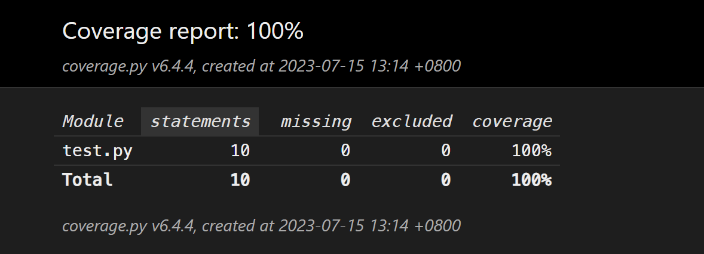
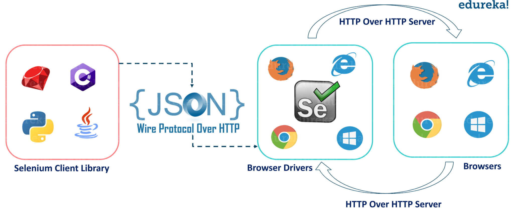

# 单元测试
!!! warning "前置要求"
    在进行本次作业前，请先阅读[清软论坛说明](./bbs.md)，**确保**对项目的基本操作和开发流程有所了解。

测试驱动开发（Test-Driven Development，简称TDD）是一种软件开发方法，它依赖于编写测试来驱动整个开发过程。TDD的基本思想是在编写任何新的功能代码之前，首先编写测试。这些测试最初会失败，因为功能代码还不存在。然后，开发者编写最少量的代码来使测试通过，最后重构代码以达到最佳实践。

TDD的过程通常遵循“红-绿-重构”（Red-Green-Refactor）的循环：

1. **红色阶段**：首先编写一个失败的测试。这个测试应该基于你想要实现的新功能。

2. **绿色阶段**：编写代码使测试通过。在这个阶段，你的目标是尽快让测试通过，即使这意味着你的代码不是最优的。

3. **重构阶段**：在测试通过后，你可以重构代码，以去除重复的代码，提高代码的可读性，或者使用更好的设计模式等。在重构阶段，你可以放心地修改代码，因为你有测试来保证你的修改不会破坏现有的功能。

因此测试在现代软件开发中是非常重要的，它可以帮助我们提高代码的质量，减少 bug 的产生，提高代码的可读性，降低代码的维护成本。在本次作业中，我们将学习如何在软件开发中进行代码风格测试、单元测试、集成测试和端到端测试。
## 环境搭建
推荐使用 [Visual Studio Code](https://code.visualstudio.com/) 编辑器完成本次作业

### 安装 Python 环境
推荐使用 [Anaconda](https://www.anaconda.com/products/individual) 或者 [Miniconda](https://docs.conda.io/en/latest/miniconda.html) 来管理 Python 环境，这两种工具都提供了一种高效的方式来处理Python环境和包的安装、更新和管理。当然你也可以使用 virtualenv 等其他工具来管理 Python 环境。

??? tip "关于虚拟环境"
    当使用 Python 开发软件时，一个基本的方法是在机器上安装 Python，通过终端安装所有的库，然后在终端中运行代码

    这对于简单的 Python 脚本项目来说效果很好，但是在复杂的软件开发项目中，比如构建一个 Python 库或者软件开发工具包，往往要处理多个文件、多个包和依赖关系，这可能会导致版本冲突，考虑下面的情况

    - 程序 A 依赖于库 X 的 1.0 版本
    - 程序 B 依赖于库 X 的 2.0 版本
    - 库 X 的 1.0 版本和 2.0 版本之间存在不兼容的 API，即程序 A 和程序 B 无法同时运行

    这是使用 Python 构建软件时经常遇到的问题，而虚拟环境可以帮助我们解决这个问题。它可以在不同的项目中使用不同的 Python 版本和依赖包，从而避免了**版本冲突**的问题，你可以将虚拟环境简单地理解为每一个项目都有一个**独立**的 Python 环境。
    

运行如下命令来创建虚拟环境并安装必要的依赖。
```shell
# 创建一个名为 SimpleBBS 的虚拟环境，Python 版本为 3.8
$ conda create -n SimpleBBS python=3.8
# 激活虚拟环境
$ conda activate SimpleBBS
# 使用 pip 安装依赖
$ pip install -r requirements.txt
# 如果安装失败，可以改用清华镜像源
$ pip install -r requirements.txt -i https://pypi.tuna.tsinghua.edu.cn/simple
```
### 填充数据库
在 `manage.py` 文件中，我们已经实现了一个名为 `init_db` 的命令。这个命令的主要功能是使用测试数据来填充数据库。这种设计的目的是为了方便我们进行软件测试，因为在实际的软件开发过程中，我们经常需要在一个预设的环境中进行各种测试。
```shell
$ python manage.py makemigrations app user post
$ python manage.py migrate
$ python manage.py init_db
```
填充的用户名为 `test_thss`，密码为 `test_thss`。

接下来创建一个超级用户，以便在后续的测试中使用。
```shell
$ python manage.py createsuperuser
```
按提示输入用户名、邮箱和密码即可。

接下来就可以使用 `python manage.py runserver` 来运行 Django 服务了。
```shell
$ python manage.py runserver

Watching for file changes with StatReloader
Performing system checks...

System check identified no issues (0 silenced).
August 26, 2023 - 20:16:09
Django version 4.1.4, using settings 'app.settings'
Starting development server at http://0.0.0.0:8000/
Quit the server with CONTROL-C.
```
可以通过 `http://localhost:8000/admin` 来访问 Django 的后台管理系统，使用刚才创建的超级用户登录即可。


### 前端
项目提供了基于 React 实现的前端，你可以在 `frontend` 目录中找到前端代码。在运行前端之前，你需要安装 `node.js` 和 `npm`。
运行下列命令来安装依赖并启动前端服务。
```shell
# 安装依赖
$ npm install --package-lock=package-lock.json
# 启动前端服务
$ npm start
```
访问 `http://localhost:3000` 即可看到前端页面。使用填充的测试数据登录。


### 配置浏览器Driver
端到端测试需要使用浏览器来模拟用户的行为，所以需要安装浏览器驱动，推荐使用 Chrome 浏览器和 ChromeDriver。

1. 在浏览器地址栏中输入 `chrome://version/`，查看 Chrome 浏览器的版本号。
2. 在`https://chromedriver.chromium.org/downloads` 下载兼容版本的 ChromeDriver，如果你的 Chrome 版本比较新，可以在 [这里](https://googlechromelabs.github.io/chrome-for-testing/) 下载对应版本的 ChromeDriver。
3. 解压后将其放在代码根目录下的 `drivers` 目录中。
4. 修改 `tests/test_e2e.py` 中的 `DRIVER_PATH` 变量，将其指向 ChromeDriver 的实际路径。

你可以在项目根目录中使用 `python driver.py` 来测试 ChromeDriver 是否配置正确。

!!! question "运行 `drvier.py` 出现错误"
    如果运行 `driver.py` 出现类似于下面的错误
    ```shell
    ValueError: Timeout value connect was <object object at 0x00000225D858F0C0>, but it must be an int, float or None.
    ```
    原因是 `urlib3` 版本和 `selenuim` 版本不兼容，可以通过下面的命令降低 `urllib3` 的版本来解决这个问题。
    ```shell
    $ pip uninstall urllib3
    $ pip install urllib3==1.26.2
    ```

### 运行测试
在准备好上述环境后，就可以运行测试了。
```shell
# 运行所有测试
$ python manage.py test
# 查看命令文档
$ python manage.py test --help
# 筛选运行测试
$ python manage.py test --filter (test_api|test_basic|test_e2e) # FIXME: 当前只能输入一个进行测试，例如--filter test_basic，多个测试暂时不支持
```
初次运行测试，部分测试可能会失败，这是因为我们还没有实现相应的功能。
```
test_login (test_api.APITestCase)
TODO: 使用错误的信息进行登录，检查返回值为失败 ... ok
test_logout (test_api.APITestCase)
TODO: 未登录直接登出 ... ok
test_register (test_api.APITestCase)
Example: 使用错误信息进行注册，检查返回值为失败 ... ok
test_register_params_check (test_basic.BasicTestCase) ... ok
test_web (test_e2e.SeleniumTestCase)
EXAMPLE: 使用测试用户进行登录 ... ok

Coverage Report:

Name                               Stmts   Miss Branch BrPart  Cover
--------------------------------------------------------------------
post\controllers.py                   98     86     18      0    10%
post\urls.py                           3      0      0      0   100%
post\views.py                         98     82     44      0    11%
user\controllers.py                   32     26      6      0    16%
user\urls.py                           3      0      0      0   100%
user\views.py                         62     49     18      0    16%
utils\jwt.py                          48     33     10      0    26%
utils\post_params_check.py             2      1      0      0    50%
utils\register_params_check.py         3      0      0      0   100%
utils\reply_post_params_check.py       2      1      0      0    50%
--------------------------------------------------------------------
TOTAL                                351    278     96      0    16%
```
至此，测试环境已经搭建完成，下面开始介绍本次作业的相关内容。

!!! danger "测试环境和部署环境"
    注意，以上的环境是测试环境，不是部署环境。在部署环境中，我们需要使用 **MySQL** 数据库，而不是 SQLite 数据库。因此，在部署环境中，你需要修改 `app/settings_prod.py` 中的数据库配置，具体请参考 [清软论坛说明](./bbs.md) 部分

## 代码风格测试
统一的代码风格具有多种重要的优点，这些优点不仅对个人开发者有益，对团队协作也至关重要。

首先，统一的代码风格可以显著提高代码的可读性和质量。当所有的代码都遵循同一套规则和约定时，阅读和理解代码将变得更加容易。这对于代码的维护和调试都非常有帮助，因为开发者可以更快地理解代码的结构和功能。

其次，统一的代码风格可以减少团队沟通的成本。在团队开发中，开发者需要阅读和理解其他人的代码。如果每个人都有自己的代码风格，那么理解他人的代码将需要更多的时间和精力。而统一的代码风格可以使所有的代码看起来都很相似，从而减少了理解代码的难度。

最后，统一的代码风格也有其美学价值。良好、一致的代码风格可以使代码看起来更加整洁和有序，这不仅可以提高开发者的工作效率，也可以使开发者在编写和阅读代码时有更好的心情。

因此，无论是从提高代码质量、减少沟通成本，还是从美学和心理健康的角度来看，统一的代码风格都是非常有益的。

代码风格检查有多种工具，下面是一些常用的工具：

- [flake8](https://flake8.pycqa.org/en/latest/)：检查代码风格和错误。
- [autoflake](https://github.com/PyCQA/autoflake)：自动删除无用的导入和变量。
- [autopep8](https://pypi.org/project/autopep8/)：自动修复代码风格错误。
- [isort](https://github.com/PyCQA/isort)：自动对导入进行排序和格式化。

以上几种工具均可以使用 `pip` 进行安装。

- `flake8` 可以自动检查代码是否符合 PEP8 规范。
    ```shell
    $ flake8 .
    ```
- `autoflake` 和 `autopep8` 可以自动修复不符合规范的代码。
    ```shell
    $ autoflake .
    $ autopep8 .
    ```
- `isort` 可以自动对导入进行排序和格式化。
    ```shell
    $ isort .
    ```
这些工具都支持通过**配置文件**的形式来配置检查规则，以 `flake8` 为例，在运行 `flake8` 的目录下创建 `.flake8` 文件，那么在运行时会自动读取该文件中的配置。

## 单元测试
单元测试是软件开发中的一种测试方法，它的主要目标是验证代码中的最小可测试单元（通常是函数、方法或类）是否按预期工作。每个单元测试都应该是独立的，可以单独运行，而不依赖于任何其他代码或外部资源。

单元测试的重要性和必要性主要体现在以下几个方面：

1. **错误检测**：单元测试可以帮助开发者在早期发现代码中的错误或问题，这样可以在问题变得更复杂和难以解决之前进行修复。

2. **代码质量**：通过编写单元测试，开发者可以确保代码的质量，因为这迫使他们写出可测试的、模块化的代码，这样的代码更容易理解和维护。

3. **简化重构**：当你需要修改或重构代码时，有了单元测试，你可以更有信心地进行，因为你知道如果你的修改破坏了现有的功能，测试将会失败。

4. **文档**：单元测试也可以作为一种形式的文档，它们可以显示代码的预期行为，并为其他开发者提供示例代码。

5. **回归测试**：当你添加新功能或修复错误时，单元测试可以确保你没有破坏现有的代码。

本次作业中使用 Python 的 unittest 模块来编写单元测试，具体可以参考 [unittest 文档](https://docs.python.org/zh-cn/3/library/unittest.html)。

在使用 unittest 编写单元测试时，测试通常以类的形式进行组织，并且这些类会继承自 `unittest.TestCase` 类。这种设计允许我们将相关的测试逻辑集中在一起，同时利用继承自 `unittest.TestCase` 的类提供的各种测试工具和方法。

每个具体的测试用例则以函数的形式存在于这些类中，这些函数的名称通常以 `test_` 为前缀。这是一个约定，unittest框架会自动运行所有以 `test_` 开头的方法作为测试用例。这种设计使得每个测试用例都可以作为一个独立的函数进行编写和运行，提供了很大的灵活性。

举例来说，如果想要测试 Python 中 String 类的 `upper()` 方法和 `isupper()` 方法，可以编写如下的测试用例：

```python
import unittest

class TestStringMethods(unittest.TestCase):

    def test_upper(self):
        self.assertEqual('foo'.upper(), 'FOO')
        with self.assertRaises(TypeError):
            raise TypeError

    def test_isupper(self):
        self.assertTrue('FOO'.isupper())
        self.assertFalse('Foo'.isupper())
        with self.assertRaises(TypeError):
            raise TypeError
```
可以直接在 `__main__` 中运行该测试用例：
```python
if __name__ == '__main__':
    unittest.main()
```

同时，你也可以选择使用命令行来运行这些测试用例，我们将上述测试类代码保存到名为 `test.py` 的文件中，并运行如下命令
```shell
$ python -m unittest test.py
```

在运行完测试用例之后，可能需要对测试用例的覆盖率进行统计，这时可以使用 `coverage` 工具，具体使用方法可以参考 [coverage 文档](https://coverage.readthedocs.io/en/7.2.7/)。

使用 `coverage` 的命令行工具以统计覆盖率：
```shell
# 运行测试
$ coverage run test.py
# 命令行中生成覆盖率报告
$ coverage report
# 生成 HTML 格式的覆盖率报告，通过 htmlcov/index.html 查看
$ coverage html
```


<figure markdown>
{loading=lazy}
<figcaption>网页版本的覆盖率报告</figcaption>
</figure>


## 集成测试

集成测试（Integration Testing）是软件开发生命周期中的一个重要阶段，它是在单元测试之后进行的。在单元测试中，开发者会测试单个模块或组件的功能。然而，单元测试并不能保证这些模块或组件在一起工作时也能正常运行。这就是集成测试的目的：验证多个模块或组件在一起工作时的行为。
集成测试的主要步骤包括：

1. **模块组合**：根据系统设计，将各个模块按照特定的顺序组合在一起。这个顺序通常是根据模块之间的依赖关系来确定的。

2. **测试**：运行组合后的模块，并检查它们是否能够正确地一起工作。这包括检查数据是否能够正确地在模块之间传递，以及模块是否能够正确地响应其他模块的行为。

3. **错误修复**：如果在测试中发现了错误，那么需要修复这些错误，然后重新进行测试，直到所有的模块都能够正确地一起工作。

集成测试能够检查模块间的交互，往往能发现全局级别的问题。

本次作业用使用 `Django` 自带的 `unittest` 框架来编写集成测试，具体可以参考 [Django 文档](https://docs.djangoproject.com/en/4.1/topics/testing/overview/)。

你需要做的是补全 `tests/test_api.py` 中被标注为 `TODO` 的测试用例，然后运行如下命令：
```shell
$ python manage.py test --filter test_api
```
评测时按照顺序正确测试对应路由即可获取这部分分数

## 端到端测试
端到端测试（End-to-End Testing）是软件测试的一种类型，它的目标是验证**整个系统或应用**从开始到结束是否按预期工作。这种测试方法涵盖了所有的交互路径，包括所有的子系统和服务，以及它们之间的交互。端到端测试的目标是模拟真实用户场景，以确保整个系统在所有的组件和服务一起工作时能够正常运行。

相比起前两种测试，端到端测试

- 通过添加比其他测试方法（如单元和功能测试）更详细的测试案例，扩大测试范围。
- 通过运行基于终端用户行为的测试用例，确保应用程序的正确执行。
- 通过自动化关键用户路径缩短应用测试周期。
- 通过减少测试软件的时间，降低构建和维护软件的总体成本。
- 有助于可预测地、可靠地检测错误。

有众多工具进行端到端测试，例如 Selenium、Cypress、TestCafe 和 PlayWright 等。本次作业使用 Selenium 进行端到端测试，Selenium是一个用于Web应用程序测试的工具，**直接运行在浏览器中**，模拟真正的用户操作，测试应用程序功能，验证用户的实际需求。具体可以参考 [Selenium 文档](https://www.selenium.dev/documentation/en/)。


<figure markdown>
{loading=lazy}
<figcaption> Selenium 通过多种语言的 Binding 与浏览器进行交互
</figcaption>
</figure>

下面以一个简单的例子来说明 Selenium 的使用方法。假设我们要测试的网页是 `https://www.baidu.com`，我们可以使用 Selenium 的 Python Binding 来编写测试用例：
```python
# test_selenium.py
from selenium import webdriver
from selenium.webdriver.common.keys import Keys
from selenium.webdriver.common.by import By
import time
driver = webdriver.Chrome('drivers/chromedriver.exe')
driver.get("http://www.baidu.com")
assert "百度" in driver.title
# https://selenium-python.readthedocs.io/locating-elements.html
elem = driver.find_element(By.NAME, "wd")
elem.clear()
elem.send_keys("软件工程")
elem.send_keys(Keys.RETURN)
time.sleep(5)
driver.close()
```
将 Drvier 放在项目根目录下的 `drivers` 文件夹中，然后运行：
```shell
$ python test_selenium.py
```
你会发现浏览器自动打开，然后在搜索框中输入 `软件工程`，然后自动检索，在等待10秒后自动关闭浏览器。

在本次作业中，你需要补全 `tests/test_e2e.py` 中被标注为 `TODO` 的测试用例，然后运行如下命令：
```shell
$ python manage.py test --filter test_e2e
```


## 作业要求

### 代码风格测试
在该部分中，你需要为SimpleBBS增加代码风格检查，要求如下：

* 完善flake8配置文件

    * 要求忽略且仅忽略.git，\_\_pycache\_\_文件夹
    * 对 `tests/test_e2e.py` 忽略E501错误，对 `tests/test_api.py` 忽略E501错误
    
* 完善格式化脚本lint.sh，脚本执行命令如下

    * 使用 autopep8 对代码自动格式化
    * 使用 autoflake 对代码自动格式化
    * 使用 isort 对代码自动格式化
    * 使用 flake8 检查代码风格

!!! note "Windows 用户注意事项"
    Windows 用户在 PowerShell 中运行脚本时可能会遇到权限问题，可以使用管理员权限打开 PowerShell 并在其中输入 `Set-ExecutionPolicy RemoteSigned` 来解决。

    解决权限问题后，使用下面的命令运行脚本：
    ```powershell
    # 运行脚本
    $ .\lint.ps1
    ```


经过正确配置 autoflake、autopep8、isort 对代码自动格式化后，执行flake8检查代码风格时，**不会输出任何错误或警告**
### 单元测试
补充基础函数和单元测试分别占50%

在该部分中，同学们需要以**测试驱动开发的方式**补完下列函数，并使用 unittest 补充相应的单元测试

1. `register_params_check` 函数，该函数在 **`utils/register_params_check.py`** 文件中，实现注册账号 API 参数的校验。接收参数如下：

    * `username`: 必填，用户账号
    * `password`: 必填，用户密码
    * `nickname`: 必填，用户昵称
    * `url`: 必填，用户个人地址链接
    * `mobile`: 必填，手机号
    * `magic_number`: 选填，用户喜欢的幸运数字

    **参数要求：**

    - 用户账号为长度5-12的字母串加数字，且必须包含这两种类型，所有字母串必须在数字前面，字母包括大写字母和小写字母
    - 用户密码为长度8-15的字符串，由大写、小写字母、数字和标点符号组成且必须包含这四种类型，有效的标签符号为-_*^
    - 用户的手机号的格式为+[区号].[手机号]，其中区号必须为两位数字，手机号必须为11位数字
    - 用户的个人地址链接包含协议和域名两部分
        - 协议部分必须为http://或者https://
        - 域名部分包含1到多个点`.`，表示以点`.`分隔的标签序列，且总长度不超过48个字符。标签序列只能由下列字符组成：
            - 大小写字母`A`到`Z`和`a`到`z`
            - 数字`0`到`9`，但最后一段顶级域名不能是纯数字（如 `163.com `可以但 `163.126` 不可以）
            - 连字符`-`，但不能作为首尾字符
    - magic_number为非负数 <span style="color: red">int</span> 数值，可选参数（在设计测试用例时无需考虑最大值上界）

    **返回值要求：**

      * 返回错误或缺失字段名（如有多个只需要按前述顺序返回第一个）以及一个 bool 值表示是否出错
      * 如果正确，返回 `"ok"` 以及 `True`
      * 如果magic_number缺失，请为content添加默认值为0的magic_number字段

2. 对 `register_params_check` 补充单元测试
    
    请在 `tests/test_basic.py` 的 `TODO` 处补充相应的单元测试，并使得行覆盖率不低于 <span style="color: red">80％</span>，在文档中说明的所有测试用例应在测试代码中有完整体现。

### 集成测试
在该部分中，同学们需要为 SimpleBBS 添加集成测试，请补充 `tests/test_api.py` 中的 `TODO` 部分为注册路由、登录路由和登出路由添加测试，提供了部分注册路由测试代码供同学们参考。

### 端到端测试
在该部分中，同学们需要在 `tests/test_e2e.py` 中使用 unittest 框架和 selenium 为 SimpleBBS 补充端到端测试，selenium 提供了自动化控制浏览器的能力，同学们需要使用 selenium 控制浏览器实现用户的登录、发帖、更新帖子、删除帖子操作，在 `tests/test_e2e.py` 中提供了实现自动登录的部分供同学们参考。

由于 selenium 需要用到 WebDriver 控制浏览器，可在如下链接下载对应浏览器类型及版本的 WebDriver ，并放置于 `drivers` 目录，将 `tests/test_e2e.py` 中的 `DRIVER_PATH` 变量指向WebDriver的实际路径，如果出现错误请首先仔细阅读 [环境搭建](#环境搭建) 章节的内容。 


!!! question "注意事项"
    端到端测试需要使用浏览器和前端，但是由于助教已经在测试文件中启动了前端，所以你并不需要手动启动。

## 评测说明
- “代码风格测试”部分的评测采用脚本对代码风格进行检查，正确通过即可全分；
- “单元测试”部分采用黑盒脚本对基础函数进行测试，正确通过测试用例即可全分，单元测试人工评测，覆盖率达到要求，测试用例设计恰当合理即可全分；
- “集成测试”部分采用 Monkey Patch 对集成测试进行测试，同学们按照顺序正确测试路由函数即可全分
- “端到端测试”部分采用 Monkey Patch 对端到端测试进行测试，同学们按照顺序正确控制浏览器即可全分
## 提交说明
单元测试作业需要和 Docker 部署作业一同提交。

禁止修改无 `TODO` 标注的文件以及添加新文件。
提交压缩文件 `学号_姓名.zip` 到网络学堂。
```shell
# 将文件夹压缩为 清小软_2021000000.zip
$ python zip.py 清小软 2021000000
```
不合规的提交会被**扣除**部分分数
